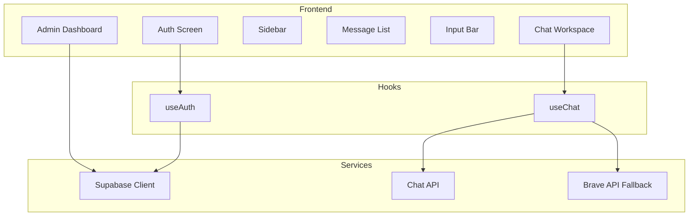

# Cyber AI 🛡️

> An AI-powered cybersecurity assistant — built with React, TypeScript, Vite, and Supabase.


---

## 📋 Table of Contents

- Overview
- Features
- Tech Stack
- Architecture
- Getting Started
- Configuration
- API Reference
- Project Structure
- Development
- Deployment
- Browser Support
- Contributing
- License

---

## Overview

Cyber AI is a full-featured cybersecurity assistant chatbot designed to help security professionals, developers, students, and enthusiasts with threat analysis, penetration testing, CTF challenges, secure coding, and more. The application provides a modern, responsive chat interface with session persistence, theme switching, and admin capabilities.

---

## ✨ Features

### Core Chat Features
- 💬 **Real-time AI chat** — Cybersecurity-focused assistant with streaming responses
- 🎨 **Dark/Light theme** — Persistent preference stored in localStorage
- 📝 **Markdown support** — Renders code blocks, tables, lists, and links
- 📤 **Export conversations** — Download chats as Markdown files
- 🔍 **Message search** — Find content across current conversation
- 📋 **Copy messages** — Copy individual messages with one click
- ✅ **Feedback system** — Upvote/downvote AI responses
- 🔄 **Regenerate responses** — Request alternative answers

### Session Management
- 📂 **Multiple sessions** — Create, switch, and delete chat sessions
- 💾 **Auto-persistence** — All conversations saved to localStorage
- 🏷️ **Session naming** — Automatically named based on first message

### User Experience
- ⌨️ **Keyboard shortcuts** — `Ctrl/Cmd+K` (search), `Ctrl/Cmd+Shift+N` (new session), `Ctrl/Cmd+Shift+L` (theme toggle)
- 🖱️ **Command palette** — Quick actions via `/` commands (`/scan`, `/clear`, `/cve`, `/explain`)
- 📱 **Fully responsive** — Works on desktop, tablet, and mobile
- ♿ **Accessible** — ARIA labels and semantic HTML
- 🚀 **Fast loading** — Vite-powered development and build

### Authentication & Admin
- 🔐 **Supabase auth** — Email/password sign-in and sign-up
- 👑 **Admin dashboard** — User management, role assignment, account deletion
- 🔒 **Role-based access** — Regular users vs. administrators
- 📊 **User analytics** — View user counts, roles, and activity

---

## 🛠 Tech Stack

| Category          | Technology                                      |
| ----------------- | ----------------------------------------------- |
| **Frontend**      | React 19 + TypeScript + Vite                    |
| **UI Icons**      | React Icons (Fi, Fa)                            |
| **Markdown**      | react-markdown + remark-gfm + syntax-highlighter |
| **Auth & DB**     | Supabase (PostgreSQL)                           |
| **Styling**       | Custom CSS with CSS Variables                   |
| **API Client**    | Native Fetch API                                |
| **State**         | React Hooks + localStorage                      |

---

## 🏗 Architecture



### Component Overview
- **AuthScreen** — Login/registration interface with Supabase
- **ChatWorkspace** — Main chat container with sidebar and message list
- **Sidebar** — Session list, user profile, admin access, sign-out
- **MessageList** — Displays messages with streaming support
- **InputBar** — Auto-resizing textarea with command palette
- **AdminDashboard** — User management panel (admin-only)

---

## 🚀 Getting Started

### Prerequisites
- Node.js 18+
- npm or pnpm
- Supabase account (for auth and database)

### Installation

```bash
# Clone the repository
git clone <your-repo-url>
cd CY

# Install dependencies
npm install

# Start development server
npm run dev
```

Open [http://localhost:5173](http://localhost:5173) in your browser.

### Environment Variables

Create a .env file in the root directory:

```env
# Supabase (required)
VITE_SUPABASE_URL=your_supabase_url
VITE_SUPABASE_ANON_KEY=your_supabase_anon_key

# Site URL (optional)
VITE_SITE_URL=http://localhost:5173

# AI APIs (optional)
VITE_API_URL=https://your-backend.onrender.com
VITE_BRAVE_API_TOKEN=your_brave_api_token

# Server-side (for admin endpoints)
SUPABASE_URL=your_supabase_url
SUPABASE_SERVICE_ROLE_KEY=your_service_role_key
```

---

## ⚙️ Configuration

### Supabase Setup

1. Create a Supabase project
2. Run the schema from schema.sql in the SQL editor
3. Enable email/password authentication
4. Set up Row Level Security (RLS) policies as defined in the schema

### API Endpoints

The application expects the following API endpoints:

| Endpoint              | Method | Description                |
| --------------------- | ------ | -------------------------- |
| `/api/chat`           | POST   | Primary AI chat endpoint   |
| `/api/admin/users`    | GET    | List all users (admin)     |
| `/api/admin/users`    | PATCH  | Update user role (admin)   |
| `/api/admin/users`    | DELETE | Delete user (admin)        |

### Brave Search API Fallback

The application can use Brave Search API as a fallback when the primary API fails. Set `VITE_BRAVE_API_TOKEN` to enable this feature.

---

## 📁 Project Structure

```
CY/
├── api/
│   └── admin/
│       └── users.ts          # Admin user management API
├── public/
├── src/
│   ├── api/
│   │   └── chat.ts           # Chat API integration
│   ├── components/
│   │   ├── AdminDashboard.tsx
│   │   ├── AuthScreen.tsx
│   │   ├── ChatWorkspace.tsx
│   │   ├── CommandPalette.tsx
│   │   ├── ErrorBanner.tsx
│   │   ├── Header.tsx
│   │   ├── InputBar.tsx
│   │   ├── MessageBubble.tsx
│   │   ├── MessageList.tsx
│   │   ├── MessageSearch.tsx
│   │   ├── Sidebar.tsx
│   │   ├── TypingIndicator.tsx
│   │   └── WelcomeScreen.tsx
│   ├── hooks/
│   │   ├── useAuth.ts        # Authentication hook
│   │   └── useChat.ts        # Chat state management
│   ├── lib/
│   │   └── supabase.ts       # Supabase client
│   ├── App.tsx
│   ├── App.css
│   ├── main.tsx
│   └── index.css
├── supabase/
│   └── schema.sql            # Database schema
├── .env
├── index.html
├── package.json
├── tsconfig.json
├── vite.config.ts
└── README.md
```

---

## 🧪 Development

### Scripts

| Command                | Description                     |
| ---------------------- | ------------------------------- |
| `npm run dev`          | Start development server        |
| `npm run build`        | Build for production            |
| `npm run preview`      | Preview production build        |
| `npm run lint`         | Run ESLint                      |

### Keyboard Shortcuts

| Shortcut                          | Action                 |
| --------------------------------- | ---------------------- |
| `Ctrl/Cmd + K`                    | Toggle message search  |
| `Ctrl/Cmd + Shift + N`            | New chat session       |
| `Ctrl/Cmd + Shift + L`            | Toggle theme           |
| `Escape`                          | Close search / dialogs |
| `/`                               | Open command palette   |
| `Enter` (input)                   | Send message           |
| `Shift + Enter` (input)           | New line               |

### Code Quality

- TypeScript for type safety
- ESLint for code linting
- Component memoization for performance
- Accessibility standards (ARIA labels)

---

## 🌐 Deployment

### Deploy to Vercel

1. Push your code to a GitHub repository
2. Import the project on Vercel
3. Add environment variables:
   - `VITE_SUPABASE_URL`
   - `VITE_SUPABASE_ANON_KEY`
   - `VITE_SITE_URL`
   - `VITE_API_URL` (optional)
   - `VITE_BRAVE_API_TOKEN` (optional)
4. Deploy

### Deploy to Netlify

```bash
npm run build
# Upload the `dist` folder to Netlify
```

### Deploy to Render (Backend API)

The backend API can be deployed separately on Render.com with the same environment variables.

---

## 🌍 Browser Support

| Browser         | Version |
| --------------- | ------- |
| Chrome          | 90+     |
| Firefox         | 88+     |
| Safari          | 14+     |
| Edge            | 90+     |
| iOS Safari      | 14+     |
| Chrome for Android | 90+  |

---

## 🤝 Contributing

1. Fork the repository
2. Create a feature branch (`git checkout -b feature/amazing-feature`)
3. Commit your changes (`git commit -m 'Add some amazing feature'`)
4. Push to the branch (`git push origin feature/amazing-feature`)
5. Open a Pull Request

---

## 📄 License

This project is proprietary and confidential. Unauthorized copying, distribution, or use is strictly prohibited.

---

## 📞 Support

For support, email me@saksham.eu.org or open an issue in the repository.

---

**Built with ❤️ for the cybersecurity community.**</markdown>
